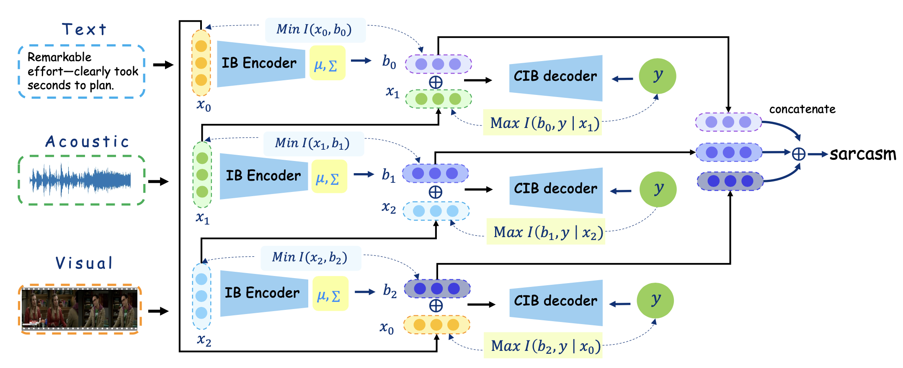

# MCIB (Multimodal Conditional Information Bottleneck)

This repository hosts the official code for the paper **"Achieving Efficient Multimodal Sarcasm Feature Fusion with Conditional Information Bottleneck."**

## Overview

The MCIB model is designed to efficiently fuse multimodal features for sarcasm detection by leveraging the Conditional Information Bottleneck (CIB) framework. The architecture employs three parallel CIB structures to filter out irrelevant information and extract relevant features between each pair of modalities.

  
*Figure 1: The diagram illustrates the overall architecture of the MCIB model. The multimodal fusion component employs three parallel conditional information bottleneck structures to filter out irrelevant information and extract relevant information between each pair of modalities. For each pair of modalities, we first minimize the mutual information between the primary modality and the latent state to achieve filtering and compression through the information bottleneck. We then maximize the conditional mutual information among the auxiliary modality, latent state, and prediction target. Finally, the bidirectional optimization within CIB produces an intermediate representation \( b \) that encapsulates the essential information required for our prediction target.*

---

## Quick Start

1. **Clone the repository and install dependencies:**
   ```bash
   cd MCIB
   pip install -r requirements.txt

2. **Download the datasets:**
   Download the required datasets and place them in the ./data directory. For more details, refer to the dataset documentation.
   I've shared "MUStARD++R" via Quark Netdisk. Just click the link to save it. Open the Quark APP and access the link https://pan.quark.cn/s/975e0d976744  Extraction code: 3BFf

3. **Train the model:**
   Train the model on the mustard_plus_plus, MOSI, or MOSEI datasets using the --dataset flag:
   ```bash
   python MCIB_trans_Train.py --dataset mustard_plus_plus
   ```
4. **Training Options:**

   Customize training: Modify MCIB_trans_Train.py to adjust variables, loss functions, or output configurations.
   Memory efficiency: Reduce max_seq_length from the default value of 50 to improve memory efficiency.
   Batch size: Adjust train_batch_size to fit your hardware memory constraints.
